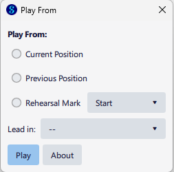

# Play From

Play From  is a plugin for MuseScore Studio (v4.4) that allows you to hear the audio playback from the predefined markers you've already included the score. 

Play From will automatically detect in the score where you have placed Rehearsal Marks, as well as where double bar lines are placed. You can also select whether to play from that measure, or from one or two measures prior to the selected measure. 

Usage
-----

**Current Position**\
Playback will begin from the current position in the score. This is wherever you are currently editing the score, or the start of the current selection. This is just the same as hitting the standard Play button in Musescore (or hitting Space when not in editing notes).

**Previous Position**\
Begin the playback from the last Current Position playback position. This is the same as using Shift+Space in Dorico to play from the previous start position. It's also kind of what inspired this plug in. 

**Rehearsal Mark**\
Begin the playback from the selected Rehearsal Mark. "Start" is added as the first in the list, and will begin playback from the start of the score. 
The drop down box lists the Rehearsal Marks you've added, and the measures that begin with a double bar line. They are listed in the order they appear in the score.  These are looked for each time the plugin is opened, so if you add or remove them from your score, simply reopen the plugin and they will appear in the list. Choosing from the drop down will also ensure that the Rehearsal Mark option is chosen. 

**Lead In**\
This option begins the playback from the specified number of measures prior to the selected option. Of course, when playing from the "Start" Rehearsal Mark, the lead in has no effect.
Three choices are provided, no lead in ("--"), 1 measure, and 2 measures. 

**Play**\
Begin playback using the selection options. 

**About**\
Open the About dialog. 

Installation
-------------
To install the plugin:
1. Download the latest version from the releases. 
1. Unzip the file contents into a separate folder. This will typically be "PlayFrom-xxx" for some version.
1. Move the folder into your MuseScore Plugins folder, which can be found here (for MuseScore 4)
   * Windows: %HOMEPATH%\Documents\MuseScore4\Plugins
   * Mac: ~/Documents/MuseScore4/Plugins
   * Linux: ~/Documents/MuseScore4/Plugins
1. Launch MuseScore
1. Select the menu item Plugins > Plugin Manager...
1. Enable the "Play From" plugin
   
To use the plugin:
1. Select the menu item Plugins > PitDad Tools > Play From.  
1. Select the appropriate options, as described above, and click "Play"

Acknowledgements
-------------
Thanks to the user Lycalp on the Musescore.org forums for the inspiration for this plugin.
   
Release History
-------------
**v1.0** - 5/6/2025 - Initial Release

